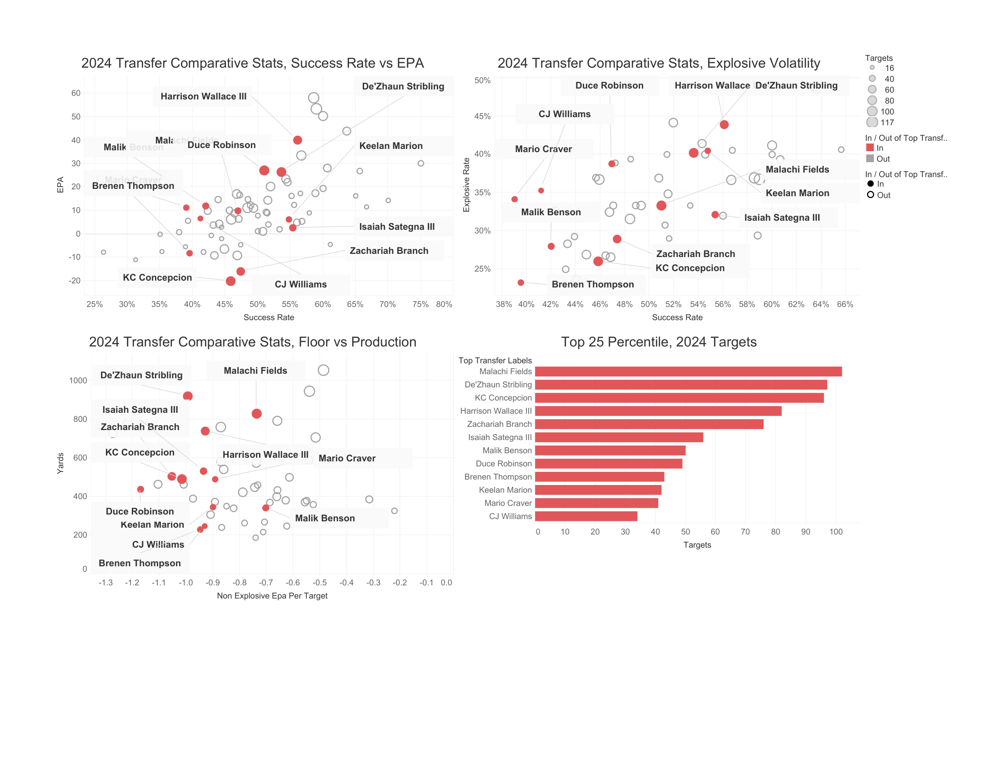

# College Football Transfer Analysis, Receivers

[**Live Interactive Tableau Dashboard**]
(https://public.tableau.com/app/profile/sheldon.wong/viz/WRTransferDashboardPart1/Dashboard1)
(https://public.tableau.com/app/profile/sheldon.wong/viz/WR2024TransferAnalysisPart1/Dashboard1)
(https://public.tableau.com/app/profile/sheldon.wong/viz/WR2024TransferAnalysisPart2/Dashboard1)

## Project Overview
An advanced analytical study evaluating 2025 transfer receivers against 1) all CFB receivers in 2024 and 2) all CFB transfer receivers in 2024, in order to determine the metrics that best predict portal success at this position

## Tech Stack & Architecture
* **Python**: Extracted raw play-by-play data and cleaned portal transfer records.
* **SQL**: Modeled relational tables, performed feature engineering (e.g., EPA/play, success rates), and aggregated seasonal stats.
* **Tableau Public**: Built interactive dashboards visualizing performance metrics post-transfer.

## Key Insights & Visualizations

1. **Insight 1**: Most likely successful transfers lie between 35 and 60 percent success rate with no more than -0.7 EPA per non-explosive target .
2. **Insight 2**: Successful transfers are players who are not "high-floor", in that they have more variance in their statistical profile. However, there is no correlation between overall production (EPA or yardage), and transfer success. 
3. **Insight 3**: To identify transfers, look for outside top third in EPA and success rate. Players higher will likely be retained by their  teams or go pro. Successful transfers are players who are not "high-floor", in that they have more variance in their statistical profile. Identify players with high variance (high explosive EPA/target, low non/explosive EPA/target) who may be undervalued. Then use film or other non-analtyical methods to identify those who could have their variance land on the right side of the coin.

## How to Reproduce
1. Clone this repository: `git clone https://github.com/yourusername/cfb-transfer-analysis.git`
2. Install Python dependencies: `pip install -r requirements.txt`
3. Run SQL scripts in `/scripts/sql/` sequentially to set up the schema and generate summary tables.